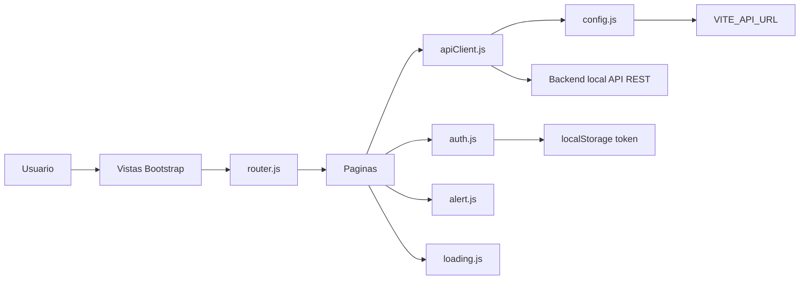
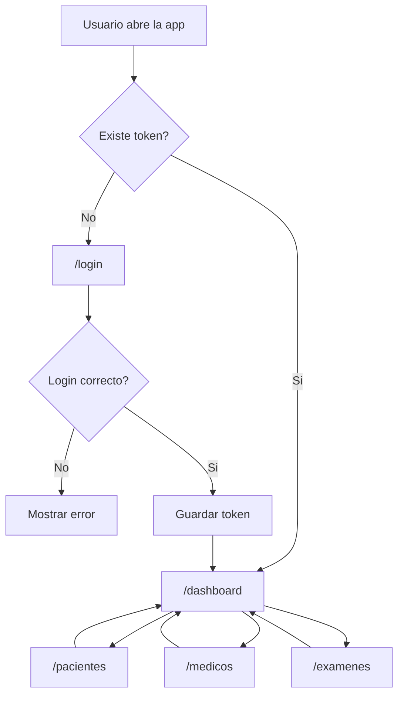
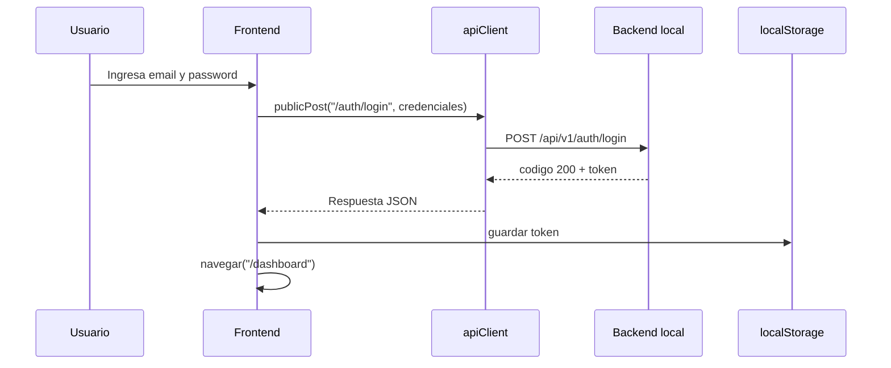
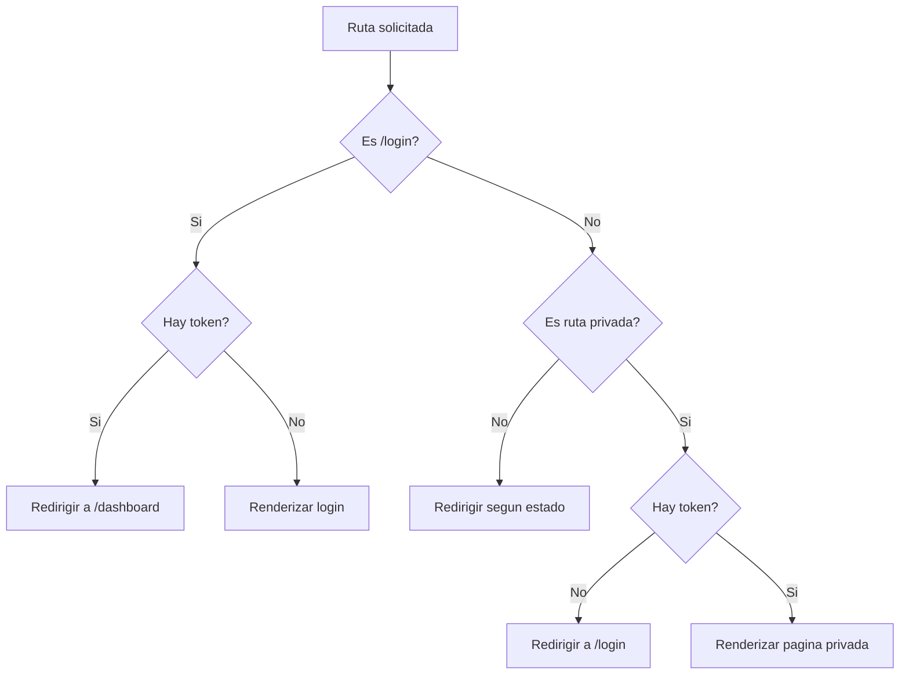
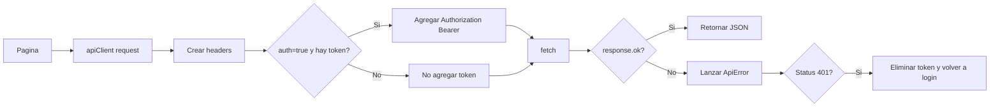
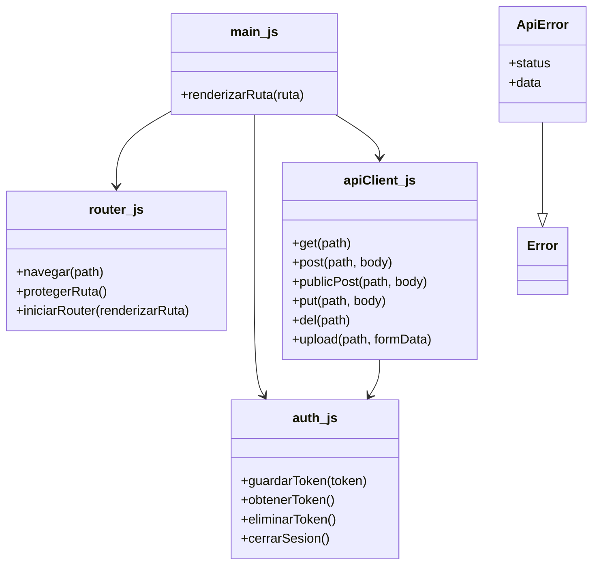
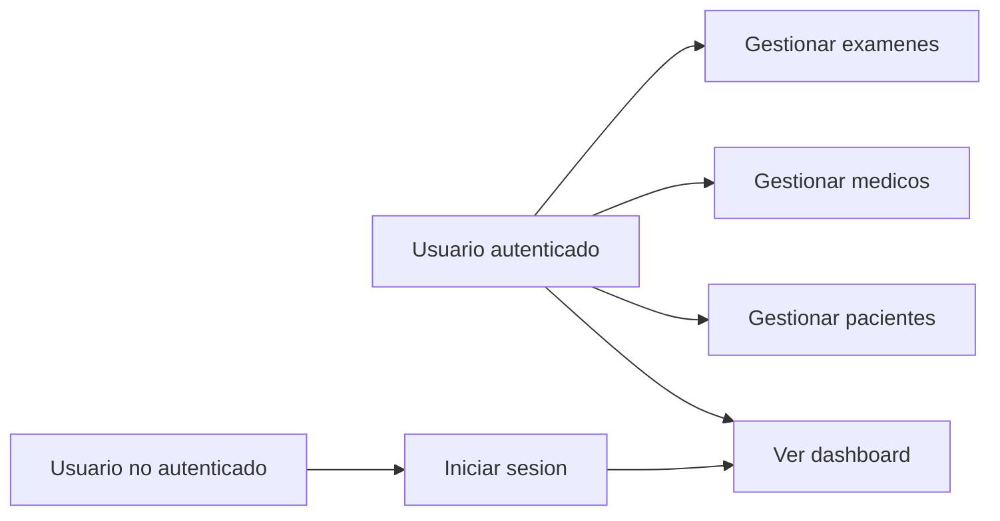

# Frontend Clinica

Documentacion tecnica del frontend de una aplicacion de gestion clinica. El proyecto fue desarrollado con Vite, JavaScript Vanilla, Bootstrap y Bootstrap Icons. El frontend consume exclusivamente el backend local mediante `fetch`.

## Alcance Del Frontend

Este repositorio corresponde solo a la capa de interfaz de usuario. Su responsabilidad es:

- Mostrar las pantallas del sistema clinico.
- Autenticar usuarios mediante la API local.
- Guardar el token JWT en `localStorage`.
- Proteger las rutas privadas del frontend.
- Consumir endpoints REST del backend local.
- Mostrar datos en tablas y formularios Bootstrap.
- Validar datos antes de enviarlos al backend.
- Mostrar alertas de exito/error y estados de carga.

Este frontend no se conecta directamente a PostgreSQL. La base de datos, Sequelize, modelos, migraciones, middlewares JWT y persistencia pertenecen al backend.

## Requerimientos Funcionales

| Codigo | Requerimiento | Implementacion frontend |
| --- | --- | --- |
| RF-01 | Iniciar sesion | Pantalla `/login` con email y password |
| RF-02 | Guardar sesion | Token JWT guardado en `localStorage` |
| RF-03 | Proteger pantallas privadas | Router valida token antes de renderizar rutas privadas |
| RF-04 | Ver informacion general de la API | Dashboard consume `GET /acerca` |
| RF-05 | Gestionar pacientes | Pantalla `/pacientes` con listar, crear, editar y eliminar |
| RF-06 | Gestionar medicos | Pantalla `/medicos` con listar, crear, editar y eliminar |
| RF-07 | Gestionar examenes | Pantalla `/examenes` con listado y subida de PDF |
| RF-08 | Mostrar mensajes al usuario | Alertas Bootstrap reutilizables |
| RF-09 | Mostrar estados de carga | Utilidad `loading.js` |
| RF-10 | Cerrar sesion | Boton en navbar elimina token y redirige a login |

## Requerimientos No Funcionales

| Codigo | Requerimiento | Implementacion |
| --- | --- | --- |
| RNF-01 | Interfaz clara y simple | Bootstrap, contenedores, tablas, botones y modales |
| RNF-02 | Responsividad | Uso de grid Bootstrap y estilos adaptables |
| RNF-03 | Configuracion por entorno | Uso de `.env` con `VITE_API_URL` |
| RNF-04 | Seguridad basica de frontend | No consumir URLs externas ni conectar a PostgreSQL |
| RNF-05 | Mantenibilidad | Separacion por modulos: `api`, `pages`, `utils`, `components` |
| RNF-06 | Reutilizacion | `apiClient.js`, `auth.js`, `alert.js`, `loading.js` |

## Por Que Se Uso Vite

Vite se uso porque es una herramienta moderna para desarrollar aplicaciones frontend de forma rapida y simple.

Ventajas principales:

- Inicio rapido del servidor de desarrollo.
- Recarga inmediata de cambios durante el desarrollo.
- Configuracion sencilla para proyectos JavaScript.
- Soporte nativo para modulos ES (`import` / `export`).
- Manejo simple de variables de entorno con `import.meta.env`.
- Build optimizado para produccion.
- Menos configuracion manual que herramientas tradicionales.
- Buena integracion con Bootstrap y librerias instaladas por npm.

En este proyecto Vite permite levantar el frontend en:

```text
http://localhost:5173
```

Y leer la URL de la API local desde:

```js
import.meta.env.VITE_API_URL
```

## Tecnologias Utilizadas

| Tecnologia | Uso |
| --- | --- |
| Vite | Servidor de desarrollo y build |
| JavaScript Vanilla | Logica de interfaz sin framework |
| Bootstrap | Estilos, grilla, formularios, tablas, botones y modales |
| Bootstrap Icons | Iconos de navegacion y acciones |
| Fetch API | Comunicacion HTTP con el backend |
| LocalStorage | Almacenamiento del token JWT |
| ES Modules | Organizacion por archivos importables |

## Configuracion Local

Antes de levantar el frontend debe estar corriendo el backend local:

```bash
npm run dev
```

Backend esperado:

```text
http://localhost:3000
```

API base:

```text
http://localhost:3000/api/v1
```

Archivo `.env` del frontend:

```env
VITE_API_URL=http://localhost:3000/api/v1
```

Importante:

- No usar URL de produccion.
- No usar IP externa.
- No conectarse directo a PostgreSQL desde el frontend.
- El frontend solo consume el backend local mediante `fetch`.

## Instalacion Y Ejecucion

Instalar dependencias:

```bash
npm install
```

Levantar servidor de desarrollo:

```bash
npm run dev
```

Abrir:

```text
http://localhost:5173
```

Compilar:

```bash
npm run build
```

## Credenciales De Prueba

```json
{
  "email": "admin@clinica.dev",
  "password": "123456"
}
```

## Arquitectura Frontend

El frontend usa una arquitectura modular simple. Cada responsabilidad esta separada en archivos especificos.



## Estructura De Carpetas

```text
src/
  api/
    apiClient.js
  components/
    navbar.js
  pages/
    dashboardPage.js
    examenesPage.js
    loginPage.js
    medicosPage.js
    pacientesPage.js
  utils/
    alert.js
    auth.js
    loading.js
    router.js
  config.js
  main.js
  style.css
```

## Descripcion De Modulos

| Archivo | Responsabilidad |
| --- | --- |
| `src/main.js` | Punto de entrada. Importa Bootstrap, CSS, router y paginas |
| `src/config.js` | Lee `VITE_API_URL` desde `import.meta.env` |
| `src/api/apiClient.js` | Centraliza `fetch`, JSON, errores y token JWT |
| `src/utils/auth.js` | Guarda, obtiene, elimina token y cierra sesion |
| `src/utils/router.js` | Define rutas, navegacion y proteccion de rutas privadas |
| `src/utils/alert.js` | Renderiza alertas Bootstrap de exito/error |
| `src/utils/loading.js` | Renderiza estados de carga |
| `src/components/navbar.js` | Navbar con accesos y cierre de sesion |
| `src/pages/loginPage.js` | Formulario de login y consumo de `POST /auth/login` |
| `src/pages/dashboardPage.js` | Consume `GET /acerca` y muestra informacion de API |
| `src/pages/pacientesPage.js` | CRUD visual de pacientes |
| `src/pages/medicosPage.js` | CRUD visual de medicos |
| `src/pages/examenesPage.js` | Listado y subida de examenes PDF |

## Diagrama De Rutas



## Rutas Del Frontend

| Ruta | Pantalla | Protegida | Descripcion |
| --- | --- | --- | --- |
| `/login` | Login | No | Permite iniciar sesion |
| `/dashboard` | Dashboard | Si | Muestra informacion de la API y accesos |
| `/pacientes` | Pacientes | Si | CRUD visual de pacientes |
| `/medicos` | Medicos | Si | CRUD visual de medicos |
| `/examenes` | Examenes | Si | Listado y subida de PDF |

## Flujo De Autenticacion



Detalles:

- El login usa `publicPost`, por lo tanto no envia un token viejo en el header.
- Cuando existe token, las peticiones privadas envian:

```http
Authorization: Bearer <token>
```

- Si la API responde `401`, el frontend elimina el token y redirige a `/login`.

## Diagrama De Proteccion De Rutas



## Comunicacion Con La API

Todas las peticiones pasan por `src/api/apiClient.js`.

Responsabilidades del cliente API:

- Construir URL usando `VITE_API_URL`.
- Rechazar URLs absolutas externas.
- Enviar `Accept: application/json`.
- Enviar `Content-Type: application/json` cuando corresponde.
- Convertir cuerpos JS a JSON.
- Enviar `Authorization: Bearer <token>` solo en rutas privadas.
- Manejar respuestas JSON.
- Manejar errores `400`, `401`, `404`, `500`.
- En `401`, cerrar sesion automaticamente.



## Diagrama De Modulos



Nota: El frontend usa principalmente funciones y modulos. La herencia aparece en `ApiError`, que extiende la clase nativa `Error` para representar errores de API.

## Casos De Uso Frontend



## Pantalla Login

Archivo:

```text
src/pages/loginPage.js
```

Responsabilidades:

- Mostrar formulario Bootstrap.
- Validar email y password requeridos.
- Enviar credenciales a `POST /auth/login`.
- Leer `codigo` y `token` desde la respuesta.
- Guardar token con `guardarToken`.
- Redirigir a `/dashboard`.
- Mostrar errores de login.

Endpoint usado:

```http
POST /auth/login
```

## Pantalla Dashboard

Archivo:

```text
src/pages/dashboardPage.js
```

Responsabilidades:

- Consumir informacion general de la API.
- Mostrar `codigo`, `nombre`, `version`, `descripcion` y rutas disponibles.
- Mostrar accesos a Pacientes, Medicos y Examenes.

Endpoint usado:

```http
GET /acerca
```

## Pantalla Pacientes

Archivo:

```text
src/pages/pacientesPage.js
```

Responsabilidades:

- Listar pacientes en tabla Bootstrap.
- Crear paciente desde modal.
- Editar paciente desde modal.
- Eliminar paciente.
- Mostrar alertas de exito/error.
- Refrescar tabla despues de cada operacion.

Validaciones:

- `nombre`: requerido.
- `rut`: requerido.
- `edad`: requerida y numerica.
- `diagnostico`: requerido.
- `email`: valido si se ingresa.

Endpoints usados:

```http
GET /pacientes
POST /pacientes
PUT /pacientes/:id
DELETE /pacientes/:id
```

## Pantalla Medicos

Archivo:

```text
src/pages/medicosPage.js
```

Responsabilidades:

- Listar medicos en tabla Bootstrap.
- Crear medico desde modal.
- Editar medico desde modal.
- Eliminar medico.
- Mostrar alertas de exito/error.
- Refrescar tabla despues de cada operacion.

Validaciones:

- `nombre`: requerido.
- `especialidad`: requerida.
- `email`: requerido y valido.
- `registroMedico`: requerido.

Endpoints usados:

```http
GET /medicos
POST /medicos
PUT /medicos/:id
DELETE /medicos/:id
```

## Pantalla Examenes

Archivo:

```text
src/pages/examenesPage.js
```

Responsabilidades:

- Listar examenes subidos.
- Seleccionar archivo desde `input type="file"`.
- Validar extension `.pdf`.
- Enviar archivo usando `FormData`.
- Usar el campo `archivo`.
- Refrescar listado despues de subir.

Endpoints usados:

```http
GET /examenes
POST /examenes
```

## Reglas De Negocio Aplicadas En Frontend

- Un usuario sin token no puede entrar a rutas privadas.
- Un usuario autenticado que entra a `/login` es enviado a `/dashboard`.
- El token se elimina si la API responde `401`.
- El login no envia token previo para evitar conflictos con sesiones antiguas.
- Solo se aceptan archivos con extension `.pdf` en examenes.
- Los formularios no se envian si fallan las validaciones HTML.

## Validaciones De Formularios

| Pantalla | Campo | Regla |
| --- | --- | --- |
| Login | Email | Requerido y tipo email |
| Login | Password | Requerido |
| Pacientes | Nombre | Requerido |
| Pacientes | RUT | Requerido |
| Pacientes | Edad | Requerida, numerica, minimo 0 |
| Pacientes | Diagnostico | Requerido |
| Pacientes | Email | Tipo email si se ingresa |
| Medicos | Nombre | Requerido |
| Medicos | Especialidad | Requerida |
| Medicos | Email | Requerido y tipo email |
| Medicos | Registro medico | Requerido |
| Examenes | Archivo | Requerido y extension `.pdf` |

## Manejo De Errores

El archivo `apiClient.js` centraliza los errores en la clase `ApiError`.

Estados considerados:

| Codigo | Mensaje frontend |
| --- | --- |
| 400 | La solicitud enviada no es valida |
| 401 | Tu sesion expiro. Inicia sesion nuevamente |
| 404 | El recurso solicitado no existe |
| 500 | Ocurrio un error en el servidor |

Las paginas muestran los errores mediante `alert.js`.

## Pruebas Funcionales Sugeridas

| Caso | Pasos | Resultado esperado |
| --- | --- | --- |
| Ruta privada sin token | Abrir `/dashboard` sin sesion | Redirige a `/login` |
| Login correcto | Usar credenciales validas | Guarda token y entra a `/dashboard` |
| Login incorrecto | Usar credenciales invalidas | Muestra alerta de error |
| Dashboard | Entrar a `/dashboard` | Muestra informacion de `GET /acerca` |
| Crear paciente | Completar formulario valido | Crea paciente y refresca tabla |
| Validar paciente | Enviar formulario sin nombre | Muestra validacion |
| Editar paciente | Presionar editar y guardar | Actualiza y refresca tabla |
| Eliminar paciente | Presionar eliminar | Elimina y refresca tabla |
| Crear medico | Completar formulario valido | Crea medico y refresca tabla |
| Validar medico | Email invalido | Muestra validacion |
| Subir examen PDF | Seleccionar `.pdf` y subir | Sube archivo y refresca listado |
| Subir archivo invalido | Seleccionar archivo no PDF | Muestra alerta de error |
| Token invalido | API responde 401 | Elimina token y vuelve a login |

## Checklist Para Evaluacion Frontend

- [x] Proyecto Vite Vanilla JS.
- [x] Bootstrap y Bootstrap Icons.
- [x] `.env` con `VITE_API_URL`.
- [x] Configuracion centralizada en `config.js`.
- [x] Cliente API centralizado en `apiClient.js`.
- [x] Manejo de token JWT.
- [x] Router simple.
- [x] Rutas privadas protegidas.
- [x] Login funcional.
- [x] Navbar funcional.
- [x] Dashboard con `GET /acerca`.
- [x] CRUD visual de pacientes.
- [x] CRUD visual de medicos.
- [x] Subida de examenes PDF.
- [x] Alertas de exito/error.
- [x] Estados de carga.
- [x] Documentacion tecnica del frontend.
- [x] Diagramas incluidos.

## Relacion Con La Rubrica

Este frontend aporta evidencia para los siguientes criterios:

- Interfaz funcional y responsiva con Bootstrap.
- Formularios validados.
- Login funcional.
- Dashboard y pantallas principales.
- Consumo de API REST local.
- Uso de JWT desde frontend.
- Organizacion modular del codigo.
- Documentacion tecnica con diagramas.

Los criterios de PostgreSQL, Sequelize, modelos de datos, middlewares JWT del servidor y consultas SQL deben evaluarse en el backend.
